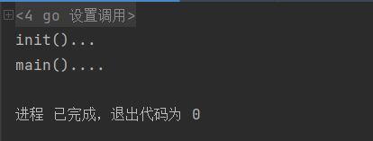
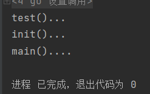

## 函数

### init函数

####     基本介绍

- 每一个文件都可以包含一个init函数，该函数在main函数之前执行，被go框架调用，也就是说init会在main之前被调用。

  例子：

  ```go
  package main
  
  import "fmt"
  func init() {
  	fmt.Println("init()...")
  }
  func main() {
  	fmt.Println("main()....")
  }
  ```

  输出结果：

  

#### init函数的注意事项和细节

1. 如果一个文件同时包含全局变量的定义、init函数和main函数，则执行的流程是全局变量定义->init函数->main函数。

   说明实例：

   ```go
   ackage main
   
   import "fmt"
   
   var age = test()
   
   func test() int {
   	fmt.Println("test()...")
   	return 90
   }
   func init() {
   	fmt.Println("init()...")
   }
   func main() {
   	fmt.Println("main()....")
   }
   ```

   运行结果：

2. init函数的主要作用就是完成一些初始化的工作。

3. 如果函数引入的包中存在全局变量的定义和init函数，则go程序先执行被引入包中的全局变量定义和init函数。

### 匿名函数

#### 介绍

- go支持匿名函数，当我们某一个函数希望只调用一次，可以使用匿名函数，匿名函数也可以实现多次调用。
- 匿名函数就是没有名字的函数。

#### 匿名函数的调用方式

1. 在定义匿名函数时直接调用。这种方式只能调用一次。

   ```go
   package main
   
   import "fmt"
   
   func main() {
   	res := func (n1 int,n2 int) int {
   		return n1+n2
   	}(10,20)
   	fmt.Println(res)
   }
   ```

   

2. 将匿名函数赋值给一个变量，通过变量可以实现多次调用匿名函数。

   ```go
   package main
   
   import "fmt"
   
   func main() {
   	a := func (n1 int,n2 int) int {
   		return n1+n2
   	}
   	res1 :=a(12,34)
   	res2 :=a(43,12)
   	fmt.Println(res1,res2)
   }
   ```

   **通过这种方式可以变相的在函数体内部定义函数。**

3. 全局匿名函数。将匿名函数赋值给全局变量


