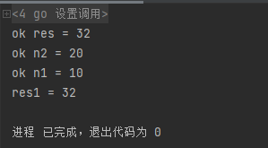

## 函数

### 包

### 函数的基本概念

### 函数的递归调用

### init函数

####     基本介绍

- 每一个文件都可以包含一个init函数，该函数在main函数之前执行，被go框架调用，也就是说init会在main之前被调用。

  例子：

  ```go
  package main
  
  import "fmt"
  func init() {
  	fmt.Println("init()...")
  }
  func main() {
  	fmt.Println("main()....")
  }
  ```

  输出结果：

  

#### init函数的注意事项和细节

1. 如果一个文件同时包含全局变量的定义、init函数和main函数，则执行的流程是全局变量定义->init函数->main函数。

   说明实例：

   ```go
   ackage main
   
   import "fmt"
   
   var age = test()
   
   func test() int {
   	fmt.Println("test()...")
   	return 90
   }
   func init() {
   	fmt.Println("init()...")
   }
   func main() {
   	fmt.Println("main()....")
   }
   ```

   运行结果：

2. init函数的主要作用就是完成一些初始化的工作。

3. 如果函数引入的包中存在全局变量的定义和init函数，则go程序先执行被引入包中的全局变量定义和init函数。

### 匿名函数

#### 介绍

- go支持匿名函数，当我们某一个函数希望只调用一次，可以使用匿名函数，匿名函数也可以实现多次调用。
- 匿名函数就是没有名字的函数。

#### 匿名函数的调用方式

1. 在定义匿名函数时直接调用。这种方式只能调用一次。

   ```go
   package main
   
   import "fmt"
   
   func main() {
   	res := func (n1 int,n2 int) int {
   		return n1+n2
   	}(10,20)
   	fmt.Println(res)
   }
   ```

   

2. 将匿名函数赋值给一个变量，通过变量可以实现多次调用匿名函数。

   ```go
   package main
   
   import "fmt"
   
   func main() {
   	a := func (n1 int,n2 int) int {
   		return n1+n2
   	}
   	res1 :=a(12,34)
   	res2 :=a(43,12)
   	fmt.Println(res1,res2)
   }
   ```

   **通过这种方式可以变相的在函数体内部定义函数。**

3. 全局匿名函数。将匿名函数赋值给全局变量

### 闭包

####     基本概念

- 闭包就是一个函数和其相关的引用环境组合的一个整体（实体）。

  ```go
  package main
  
  import "fmt"
  
  func AddUpper() func(int)int{
  var n int =10
  return func(x int) int {
  	n=n+x
  	return n
  }
  }
  func main() {
  	f := AddUpper()
  	fmt.Println(f(1))  //11
  	fmt.Println(f(2))   //13
  	fmt.Println(f(3))   //16
  }
  ```

#### 闭包的说明：

1. AddUpper是一个函数，返回的类型是func（int）int

2. 闭包说明

   ```go
   var n int =10
   return func(x int) int {
   	n=n+x
   	return n
   ```

   返回的是一个匿名函数，但是这个匿名函数引用到函数外的n，因此这个匿名函数就和n形成一个整体，构成闭包。

3. 闭包是类，函数是操作，n是字段。函数和它使用到n构成闭包。

4. 当我们反复调用f函数时，因为是初始化一次，因此每调用一次就进行一次累计。

5. 闭包的关键，就是要分析出返回的函数和它使用到哪些变量，因为函数和它引用到的变量共同构成闭包。

#### 闭包实践

输入一个文件名，判断该文件是否有后缀，如果该文件名没有后缀，则该给该文件加上指定的的后缀名suffix，使用闭包的方式实现，只需要指定一次需添加的后缀名，而使用一般函数则需要每次指定需添加的后缀。

```go
package main

import (
	"fmt"
	"strings"
)

func makesuffix(suffix string) func(string) string{
	return func(name string)string{
		if strings.HasSuffix(name,suffix)==false{
			return name + suffix
		}
		return name
	}
}
func main() {
    f := makesuffix(".jpg")
	fmt.Println("文件处理后=",f("winter"))
	fmt.Println("文件处理后=",f("bird.jpg"))
}
```

### defer

##### defer的基本机制

defer是一种延时机制。

```go
package main

import "fmt"
// 程序执行到defer语句后，先对defer进行注册压入栈，但暂不执行，等后面的语句执行完毕后在执行defer语句，
//defer语句按先入后出的方式执行
//在defer将语句压入栈时，将相关的值拷贝到栈
func sum(n1 int,n2 int)int{
	defer fmt.Println("ok n1 =",n1)
	defer fmt.Println("ok n2 =",n2)
    n1++
	n2++
	res :=n1+n2
	fmt.Println("ok res =",res)
	return res
}

func main() {
	res1 :=sum(10,20)
	fmt.Println("res1 =",res1)
}
```

运行结果：

##### defer的作用

defer最最主要的价值是在，当函数执行完毕后，可以及时的释放函数创建的资源。

1.在golang编程中的通常做法是，创建资源后，比如：打开了文件，获取了数据库链接或者锁资源，可以执行defer file.Close()

2.在defer后，可以继续使用创建资源。

3.当函数完毕后，系统会依次从defer栈中，取出语句，关闭资源。

4.这样，程序员不用再为什么时机关闭资源而烦心。

### 函数参数的传递方式

两种传递方式

1. 值传递
2. 引用传递

不论哪种传递方式，传递给函数的都是变量的副本，值传递的是值得拷贝，引用传递的是地址的拷贝。相对来说地址拷贝效率更高。

**如果希望行数内的变量能修改函数外的变量**，**可以传入变量的地址&，函数内以指针*的方式操作。**

### 变量的作用域

#### 说明：

1. 在函数内定义/声明的变量叫局部变量，作用域仅仅限于函数内部

2. 在函数外部定义/声明的变量叫全局变量，作用域整个包，如果首字母大写，则整个程序均可使用。
3. 在程序块（如for/if中）内定义/声明的变量也是局部变量，作用域仅仅限于代码块内部
